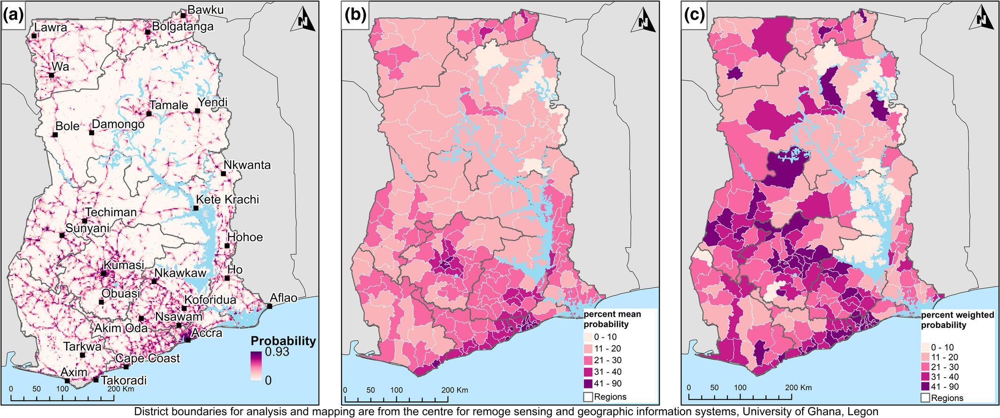

{fig-align="center"}

I am a Lecturer in Geographies of Health at University College London, specialising in spatial epidemiology and maternal health in low- and middle-income countries. My work sits at the intersection of public health, geospatial analysis, and social research, with a focus on generating actionable insights to improve health systems and outcomes.

Across academia and public health practice, I am committed to producing high-quality, policy-relevant research and supporting the next generation of scholars and practitioners in global health and geospatial data science.

## Education

::: {.callout-note icon="false"}
<i class="fa-solid fa-user-graduate fa-3x"></i>

-   PhD, Human Geography (Spatial Epidemiology) – University of Southampton

-   Thesis: Spatial patterns of birthing care utilisation in Ghana

-   MSc, Applied GIS & Remote Sensing (Distinction) – University of Southampton

-   MSc, Social Research Methods (Distinction) – University of Southampton

-   BSc, Public Health (First Class Honours) – University of Ghana

-   Diploma, Health Information Management – College of Health, Kintampo (Best Student)

-   Postgraduate Certificate in Academic Practice – Fellow of the Higher Education Academy
:::

## Professional Experience

::: {.callout-note icon="false"}
<i class="fa-solid fa-briefcase fa-3x"></i>

-   Lecturer in Geographies of Health – University College London (Current)

-   Senior Research Fellow – University of Southampton

-   Public Health Officer – Kibi Government Hospital, Ghana

-   District Health Information Officer – Atiwa District, Ghana

-   Monitoring & Evaluation Lead – Good Neighbors Ghana
:::

## Research Focus

::: {.callout-note icon="false"}
<i class="fa-solid fa-flask fa-3x"></i>

-   Spatial epidemiology

-   Maternal, newborn, child and reproductive health

-   Health systems in low- and middle-income countries

-   GIS and remote sensing in public health

-   Social research methods and health inequalities
:::

## Impact Awards

::: {.callout-note icon="false"}
🏆 South Coast DTP ESRC Impact Prize (Winner)

🥈 National ESRC Early Career Impact Prize (Runner-up, UK)

🏅 Doctoral College Director’s Award for Engagement and Impact

🎓 Commonwealth Scholarship

🎓 ESRC 1+3 Scholarship

⭐ Dean’s List (4×)
:::

## 
