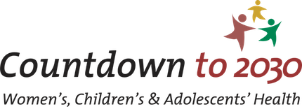

## Research Approach

My work is grounded in the belief that better data leads to better health outcomes. By combining GIS and public health methods, I examine where and why inequalities in healthcare access exist, particularly for women and children. My research supports data-driven planning, helping decision-makers allocate resources more equitably and improve health service delivery.

My research sits at the crossroads of geographic data science and public health, with a particular interest in how location and distribution of quality health services influence health outcomes. I focus on:

<i class="fa-solid fa-car-side"></i> Healthcare accessibility and utilisation

<i class="fa-solid fa-hands-holding-child"></i> Maternal, newborn, and child health

<i class="fa-solid fa-route"></i> Spatial health inequalities

<i class="fa-solid fa-hospital-user"></i> Routine health data systems

<i class="fa-solid fa-bacteria"></i> Spatial epidemiology and mapping disease patterns

## Current Projects

I’m currently involved in several collaborative research initiatives, including:

[Countdown to 2030](https://www.countdown2030.org/) – A multi-country effort working with health ministries and academic partners across more than 26 African nations. We use routine health facility data to track progress towards key health-related Sustainable Development Goals (SDGs).

[CONTAIN Project](https://gtr.ukri.org/projects?ref=MR%2FZ505316%2F1)– As a Co-Investigator on this UKRI-funded project, I work alongside a cross-disciplinary team exploring new ways to understand and manage the spread of infectious diseases through spatial and social analysis.

## Collaborations & Impact

I regularly collaborate with government health agencies, NGOs, and international partners to turn research into real-world solutions. My work has informed health strategies across low- and middle-income countries, particularly in sub-Saharan Africa. My PhD, funded by the ESRC, was [recognised nationally](https://www.ukri.org/who-we-are/how-we-are-doing/research-outcomes-and-impact/esrc/improving-access-to-pregnancy-and-birth-services-in-ghana/) and [locally](https://southcoastdtp.ac.uk/news-post/the-scdtp-is-delighted-to-announce-the-winners-of-the-2020-21-and-2021-22-scdtp-impact-prizes-congratulations-to-all-winners/) for its impact on evidence-based policymaking and capacity development in Ghana.

Below is a video produced by the ESRC highlighting my research impact in Ghana.

::: center
<iframe width="560" height="315" src="https://www.youtube.com/embed/00Z3QJWFmho" title="ESRC Impact Video" frameborder="0" allow="accelerometer; autoplay; clipboard-write; encrypted-media; gyroscope; picture-in-picture" allowfullscreen>

</iframe>
:::

## Peer-Reviewed Publications

1.  Dotse-Gborgbortsi, W., Nilsen, K., Yankey, O., Ofosu, A., Ankomah, T., Tweneboah, E., … Wright, J. (2025). Spatio-temporal patterns of health service delivery and access to maternal, child, and outpatient healthcare in Volta region, Ghana: a repeated cross-sectional ecological study using health facility data. Global Health Action, 18(1). <https://doi.org/10.1080/16549716.2025.2513861>
2.  Amouzou, A., Barros, A. J. D., Requejo, J., Faye, C., Akseer, N., Bendavid, E., Blumenberg, C., Borghi, J., El Baz, S., Federspiel, F., Ferreira, L. Z., Hazel, E., Heft-Neal, S., Hellwig, F., Liu, L., Munos, M., Pitt, C., Shawar, Y. R., Shiffman, J., ... Boerma, T. (2025). Tracking progress in reproductive, maternal, newborn, child and adolescent health and nutrition: the Countdown to 2030 for Women’s, Children’s and Adolescents’ Health report. The Lancet. <https://doi.org/10.1016/S0140-6736(25)00151-5>
3.  Wariri, O., Dotse-Gborgbortsi, W., Agbla, S. C., Jah, H., Janneh, M., Cham, M., Jawara, B. F., Nayassi, M., Marema, M., Sanneh, S., Kampmann, B., Banke-Thomas, A., Lawn, J. E., & Okomo, U. (2025). Beyond Proximity: Examining Stillbirth Rates in The Gambia and the Influence of Emergency Obstetric and Newborn Care Accessibility. BMJ Global Health. <https://doi.org/10.1136/bmjgh-2024-016579>
4.  Sylla, E. H. M., Fall, N. A., Dotse-Gborgbortsi, W., Sandie, A. B., Gueye, B. S., Senghor, D. B., Cissé, B., Bocoum, F. Y., Sy, I. O., & Faye, C. (2025). Beyond physical accessibility, bypassing health facilities offering cesarean section: a study based on women living in the slums of Dakar. BMJ Open, 15(3). <https://doi.org/10.1136/bmjopen-2024-088606>
5.  Utazi, E., Olowe, I., Chan, H. M. T., Dotse-Gborgbortsi, W., Wagai, J., Umar, J., Etamesor, S., Atuhaire, B., Fafunmi, B., Crawford, J., Adeniran, A., & Tatem, A. (2024). Geospatial variation in vaccination coverage and zero-dose 2 prevalence at the district, ward and health facility levels before 3 and after a measles vaccination campaign in Nigeria. Vaccines. <https://doi.org/10.3390/vaccines12121299>
6.  Wariri, O., Utazi, C. E., Okomo, U., Dotse-Gborgbortsi, W., Sogur, M., Fofana, S., Murray, K. A., Grundy, C., & Kampmann, B. (2024). Multi-level determinants of timely routine childhood vaccinations in The Gambia: Findings from a nationwide analysis. Vaccine, 43(2), Article 126500. <https://doi.org/10.1016/j.vaccine.2024.126500>
7.  Dwomoh, D., Iddi, S., Afagbedzi, S. K., Tejedor-Garavito, N., Dotse-Gborgbortsi, W., Wright, J., Tatem, A. J., & Nilsen, K. (2023). Impact of urban slum residence on coverage of maternal, neonatal, and child health service indicators in the Greater Accra region of Ghana: an ecological time-series analysis, 2018–2021. Journal of Urban Health. Advance online publication. <https://doi.org/10.1007/s11524-023-00812-0>
8.  Gausman, J., Pingray, V., Adanu, R., Bandoh, D. A. B., Barrueta, M., Blossom, J., Chakraborty, S., Dotse-Gborgbortsi, W., Kenu, E., Khan, N., Langer, A., Nigri, C., Odikro, M. A., Ramesh, S., Saggurti, N., Vazquez, P., Williams, C. R., & Jolivet, R. R. (2023). Validating indicators for monitoring availability and geographic distribution of emergency obstetric and newborn care (EmoNC) facilities: a study triangulating health system, facility, and geospatial data. PLoS ONE, 18(9 September), e0287904. Article e0287904. <https://doi.org/10.1371/journal.pone.0287904>
9.  Nuhu, A. G. K., Dwomoh, D., Amuasi, S. A., Dotse-Gborgbortsi, W., Kubio, C., Apraku, E. A., Timbire, J. K., & Nonvignon, J. (2023). Impact of mobile health on maternal and child health service utilization and continuum of care in Northern Ghana. Scientific Reports, 13(1), Article 3004. <https://doi.org/10.1038/s41598-023-29683-w>
10. Dotse-Gborgbortsi, W., Tatem, A., Matthews, Z., Alegana, V. A., Ofosu, A., & Wright, J. (2023). Quality of maternal healthcare and travel time influence birthing service utilisation in Ghanaian health facilities: a geographical analysis of routine health data. BMJ Open, 13(1), e066792. Article e066792. <https://doi.org/10.1136/bmjopen-2022-066792>
11. Dotse-Gborgbortsi, W., Dwomoh, D., Asamoah, M., Gyimah, F., Dzodzomenyo, M., Li, C., Akowuaha, G., Ofosu, A., & Wright, J. (2022). Dam-mediated flooding impact on outpatient attendance and diarrhoea cases in northern Ghana: a mixed methods study. BMC Public Health, 22(1), Article 2108. <https://doi.org/10.1186/s12889-022-14568-w>
12. Dwomoh, D., Amuasi, S. A., Amoah, E. M., Dotse-Gborgbortsi, W., & Tetteh, J. (2022). Exposure to family planning messages and contraceptive use among women of reproductive age in Sub-Saharan Africa: a cross-sectional program impact evaluation study. Scientific Reports, 12, Article 18941. Advance online publication. <https://doi.org/10.1038/s41598-022-22525-1>
13. Dotse-Gborgbortsi, W., Nilsen, K., Ofosu, A., Matthews, Z., Tejedor Garavito, N., Wright, J., & Tatem, A. (2022). Distance is “a big problem”: a geographic analysis of reported and modelled proximity to maternal health services in Ghana. BMC Pregnancy and Childbirth, 22(1), Article 672. <https://doi.org/10.1186/s12884-022-04998-0>
14. Dotse-Gborgbortsi, W., Tatem, A., Matthews, Z., Alegana, V. A., Ofosu, A., & Wright, J. (2022). Delineating natural catchment health districts with routinely collected health data from women's travel to give birth in Ghana. BMC Health Services Research, 22(1), 772. Article 772. <https://doi.org/10.1186/s12913-022-08125-9>
15. Aheto, J., Pannell, O. B., Dotse-Gborgbortsi, W., Trimner, M. K., Tatem, A., Rhoda, D. A., Cutts, F. T., & Utazi, C. (2022). Multilevel analysis of predictors of multiple indicators of childhood vaccination in Nigeria. PLoS ONE, 17(5 May), Article e0269066. <https://doi.org/10.1371/journal.pone.0269066>
16. Yu, W., Bain, R. E. S., Yu, J., Alegana, V. A., Dotse-Gborgbortsi, W., Lin, Y., & Wright, J. (2021). Mapping access to basic hygiene services in low- and middle-income countries: a cross-sectional case study of geospatial disparities. Applied Geography, 135, Article 102549. <https://doi.org/10.1016/j.apgeog.2021.102549>
17. Utazi, C. E., Nilsen, K., Pannell, O., Dotse-Gborgbortsi, W., & Tatem, A. J. (2021). District‐level estimation of vaccination coverage: discrete vs continuous spatial models. Statistics in Medicine, 40(9), 2197-2211. <https://doi.org/10.1002/sim.8897>
18. Simo, L. P., Agbor, V. N., Temgoua, F. Z., Fozeu, L. C. F., Bonghaseh, D. T., Mbonda, A. G. N., Yurika, R., Dotse-Gborgbortsi, W., & Mbanya, D. (2021). Prevalence and factors associated with overweight and obesity in selected health areas in a rural health district in Cameroon: a cross-sectional analysis. BMC Public Health, 21(1), Article 475. <https://doi.org/10.1186/s12889-021-10403-w>
19. Rice, B. L., Annapragada, A., Baker, R. E., Bruijning, M., Dotse-Gborgbortsi, W., Mensah, K., Miller, I. F., Motaze, N. V., Raherinandrasana, A., Rajeev, M., Rakotonirina, J., Ramiadantsoa, T., Rasambainarivo, F., Yu, W., Grenfell, B. T., Tatem, A., & Metcalf, C. J. E. (2021). Variation in SARS-CoV-2 outbreaks across sub-Saharan Africa. Nature Medicine, 27(3), 447-453. <https://doi.org/10.1038/s41591-021-01234-8>
20. Wariri, O., Onuwabuchi, E., Korem Alhassan, J. A., Dase, E., Jalo, I., Laima, C. H., Farouk, H. U., El-Nafaty, A. U., Okomo, U., & Dotse-Gborgbortsi, W. (2021). The influence of travel time to health facilities on stillbirths: a geospatial case-control analysis of facility-based data in Gombe, Nigeria. PLoS ONE, 16(1 January), Article e0245297. <https://doi.org/10.1371/journal.pone.0245297>
21. Head, M., Dotse-Gborgbortsi, W., Boateng, L., & Lartey, M. (2020). Healthcare-seeking behaviour in reporting of scabies and skin infections in Ghana – a review of reported cases. Transactions of the Royal Society of Tropical Medicine and Hygiene, 114(11), 830-837. <https://doi.org/10.1093/trstmh/traa071>
22. Dotse-Gborgbortsi, W., Tatem, A. J., Alegana, V., Utazi, C. E., Ruktanonchai, C. W., & Wright, J. (2020). Spatial inequalities in skilled attendance at birth in Ghana: a multilevel analysis integrating health facility databases with household survey data. Tropical Medicine & International Health, 25(9), 1044-1054. <https://doi.org/10.1111/tmi.13460>
23. Semey, M., Dotse-Gborgbortsi, W., Dzodzomenyo, M., & Wright, J. (2020). Characteristics of packaged water production facilities in Greater Accra, Ghana: implications for water safety and associated environmental impacts. Journal of Water Sanitation and Hygiene for Development, 10(1), 146-156. <https://doi.org/10.2166/washdev.2020.110>
24. Dotse-Gborgbortsi, W., Dwomoh, D., Alegana, V., Hill, A. G., Tatem, A., & Wright, J. (2020). The influence of distance and quality on utilisation of birthing services at health facilities in Eastern Region, Ghana. BMJ Global Health, 4(e002020), Article e002020. <https://doi.org/10.1136/bmjgh-2019-002020>\
25. Dzodzomenyo, M., Fink, G., Hill, A., Dotse-Gborgbortsi, W., Wardrop, N., Aryeetey, G., Coleman, N., & Wright, J. (2018). Sachet water and product registration: a cross-sectional study in Accra, Ghana. Journal of Water and Health, 16(2). Advance online publication. <https://doi.org/10.2166/wh.2018.055>
26. Dotse-Gborgbortsi, W., Wardrop, N., Adewole, A. P., Thomas-Possee, M. L. H., & Wright, J. (2018). A cross-sectional ecological analysis of international and sub-national health inequalities in commercial geospatial resource availability. International Journal of Health Geographics, 17(14). <https://doi.org/10.1186/s12942-018-0134-z>
27. Dzodzomenyo, M., Dotse-Gborgbortsi, W., Lapworth, D., Wardrop, N., & Wright, J. (2017). Geographic distribution of registered packaged water production in Ghana: implications for piped supplies, groundwater management and product transportation. Water, 9(142). Advance online publication. <https://doi.org/10.3390/w9020142>
28. Bosomprah, S., Dotse-Gborgbortsi, W., Aboagye, P., & Matthews, Z. (2016). Use of a spatial scan statistic to identify clusters of births occurring outside Ghanaian health facilities for targeted intervention. International Journal of Gynecology and Obstetrics, 135(2), 221-224. Advance online publication. <https://doi.org/10.1016/j.ijgo.2016.04.016>
29. Bosomprah, S., Tatem, A. J., Dotse-Gborgbortsi, W., Aboagye, P., & Matthews, Z. (2016). Spatial distribution of emergency obstetric and newborn care services in Ghana: using the evidence to plan interventions. International Journal of Gynecology & Obstetrics, 132(1), 130-134. <https://doi.org/10.1016/j.ijgo.2015.11.004>

## Global Report

1\. United Nations Population Fund, International Confederation of Midwives, World Health Organization. State of the world's midwifery 2021. New York: United Nations Population Fund; 2021. \[Technical Contributor\]
