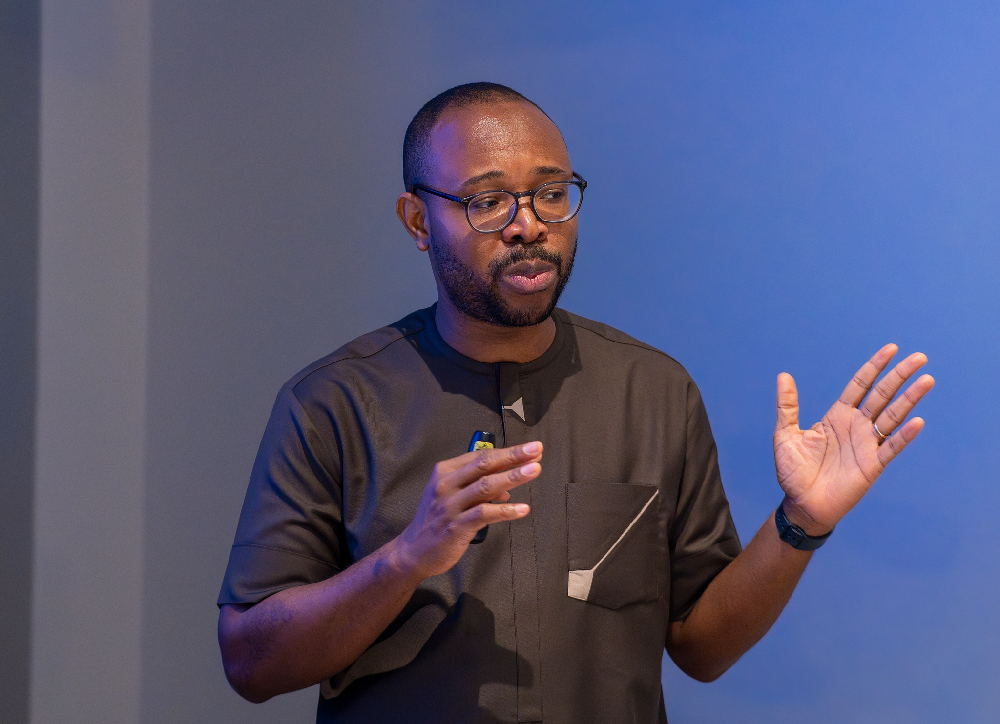

{fig-align="center"}

## 🧭 Teaching Approach

My teaching integrates geography, spatial data science, and public health. I emphasise practical skills, critical thinking, and real-world application to prepare students for research, policy, and practice.

::: callout-note
“*Winfred has been an invaluable co-lead for our module for the last two years. His input has both broadened and deepened the content of the module, bringing unique insights from his work in Ghana, enriching the teaching by directly bringing his research into the education context. He teaches clearly and engages the students very effectively”.*
:::

## 🎓 Teaching & Mentorship

I am committed to helping students and health professionals develop strong analytical, spatial, and conceptual skills, while mentoring emerging researchers in health and geographical sciences.

## 🧑‍🏫 Teaching Experience

I have taught across undergraduate and postgraduate levels, with experience in:

-    📘 Module leadership and curriculum design

-    🎤 Lectures, seminars, and GIS practicals

-    🧪 Designing applied, real-world assessments

-    💬 Student feedback and academic support

-    📊 Supervising dissertations (GIS, Remote Sensing, Applied Statistics)

I also supervise postgraduate and doctoral researchers in quantitative, spatial, and public health fields.

## 📍 Current Teaching (University College London)

-   🌍 Geographic data science

-   🌍 Foundations of Geography

-   🌍 Health geography

-   🌍 Geographic data science for public health

I support students in developing strong spatial analysis skills alongside core geographical knowledge and methods.

## 🏫 Previous Teaching (University of Southampton, 2019–2025)

### 🗺️ GIS & Spatial Analysis

-    Core Skills in GIS

-    Introductory GIS

-    Advanced GIS

-    GIS for Health Analysis

### 🩺 Public Health & Population Health

-    Health Services Organisation and Evaluation

-   Global and Population Health

-    Reproductive Health

## 🌍 Training & Capacity Building

I have delivered international training and knowledge exchange programmes across Africa and the UK.

**Focus areas:**

-   💻 Data analysis (Stata, R, QGIS)

-   📈 Routine health and survey data

-   ⚖️ Health equity and spatial inequalities
